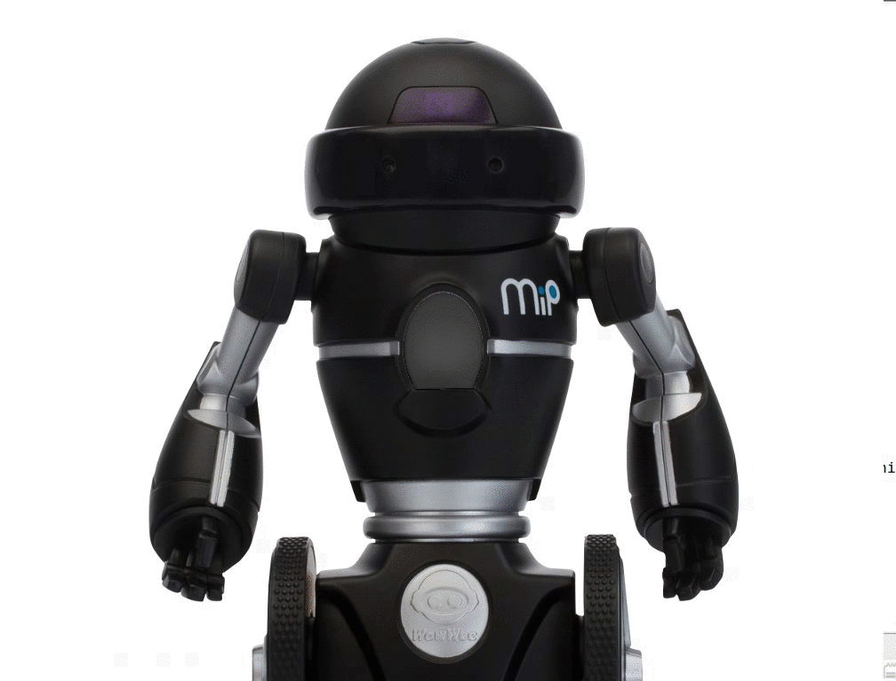
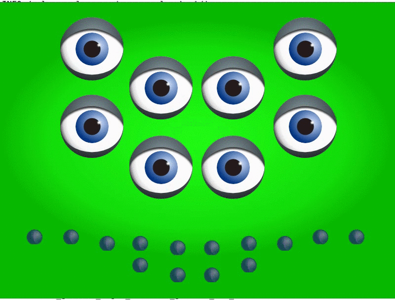

# gesture_synchronizer

[](https://travis-ci.org/arnaud-ramey/gesture_synchronizer)

<p align="center">
  
  
</p>

The gesture architecture uses the ```KeyframeGesture``` message
defined in the ```gesture_msgs``` package.

It is made of two kinds of nodes:

  - A set of ```joint_players```, one for each degree of freedom.
    They can be controllers for motors, for a voice engine, for LEDS, etc.
  - The ```gesture_synchronizer``` node, in charge of keeping all
    these ```joint_players``` synchronized.
    There must be exactly one synchronizer node running.

joint_player
============

Each ```joint_player``` is in charge of playing a gesture
at the level of a given joint (degree of freedom).
For instance, it will control the angle of a servo, or emit a sound.
This is a general interface for a gesture player.
It includes several mechanisms:

  - the subscription to the gesture topic
  - the advertising for the ack topic

Two simple generic joint players are shipped:

  1. ```SimplePlayer```: for each keyframe,
      the node publishes on its output topic a message containing the keyframe value on its output topic.

  2. ```InterpolationPlayer```: at a given rate from gesture begin to gesture end,
      the node publishes on its output topic a message containing
      the value of the joint obtained by interpolation between the last keyframe
      and the next one.

Both generic joint players support the following types:

  - std_msgs::Empty
  - std_msgs::Bool
  - std_msgs::UInt8
  - std_msgs::Int8
  - std_msgs::UInt16
  - std_msgs::Int16
  - std_msgs::UInt32
  - std_msgs::Int32
  - std_msgs::UInt64
  - std_msgs::Int64
  - std_msgs::Float32
  - std_msgs::Float64
  - std_msgs::ColorRGBA
  - std_msgs::String (only for ```SimplePlayer```, you cannot interpolate Strings)
  - geometry_msgs::Accel
  - geometry_msgs::Point32
  - geometry_msgs::Point
  - geometry_msgs::Pose2D
  - geometry_msgs::Pose
  - geometry_msgs::Quaternion
  - geometry_msgs::Twist
  - geometry_msgs::Vector3

gesture_synchronizer
=====================

This is a publisher for gesture messages.
When you publish a gesture, here is what it does in order:

  1. It first publishes the message
    (gesture_msgs::KeyframeGesture) on the dedicated channel.
    When the gesture players receive it, they will go to the initial
    position of the gesture.
    The way they do it depends on the player:
    a voice player will wait for the voice to be available,
    while a servo will physically move to the initial angle.

  2. It determines the number of acks (acknowledgement) needed to go on.
    It is determined by the number of subscribers to gestures
    at current time.
    As such, if a player dies, this number is decreased by one.

  3. it waits for the acks for all joints.

  4. when all acks are received, it emits a "play" order for all joints,
    giving them the order of starting the execution of gestures.

gesture GUI
===========

The gesture GUI is a powerful tool for creating and editing
gestures of type ```gesture_msgs::KeyframeGesture``` easily
and with a graphical interface.

On the one hand, it enables "playing" gestures by parsing XML files
and emitting them to the ROS architectures, and hence
to ```joint_players``` listening to these gestures.
A slider enables navigating through the gesture by simulating
the gesture time.

On the other hand, it subscribes to some degrees of freedom of the robot
via Qt "widgets".
The current implementation enables subscribing to any data castable to vectors of doubles.
The current state of each of these degrees of freedom can be added to
the ```gesture_msgs::KeyframeGesture``` by clicking on a button.

How to install
==============

Dependencies from sources
-------------------------

Dependencies handling is based on the [wstool](http://wiki.ros.org/wstool) tool.
Run the following instructions:

```bash
$ sudo apt-get install python-wstool
$ roscd ; cd src
$ wstool init
$ wstool merge `rospack find gesture_synchronizer`/dependencies.rosinstall
$ wstool update
```

Dependencies included in the Ubuntu packages
--------------------------------------------

Please run the ```rosdep``` utility:

```bash
$ sudo apt-get install python-rosdep
$ sudo rosdep init
$ rosdep install gesture_synchronizer --ignore-src
```

Build package with Catkin
-------------------------

```bash
$ catkin_make --only-pkg-with-deps gesture_synchronizer
```
